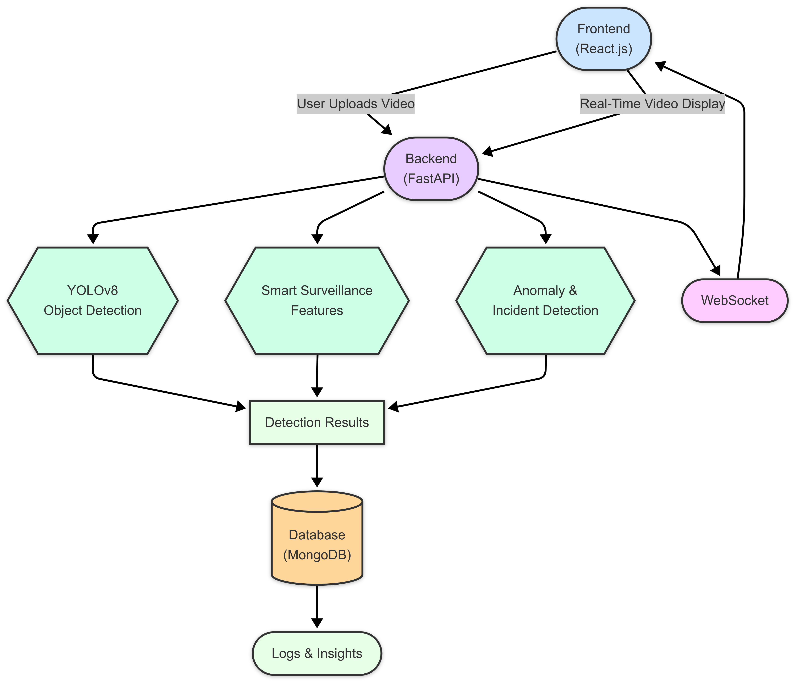

# EagleEye Vision 🚀
*AI-Powered Real-Time CCTV Video Detection and Analysis*

---

## 📌 Table of Contents

- [Introduction](#introduction)
- [Features](#features)
- [Architecture](#architecture)
- [Demo](#demo)
- [Getting Started](#getting-started)
  - [Prerequisites](#prerequisites)
  - [Installation](#installation)
  - [Running the Application](#running-the-application)
- [Project Structure](#project-structure)
- [Usage](#usage)
- [Contact](#contact)
- [Acknowledgments](#acknowledgments)

---

## Introduction

**EagleEye Vision** is a scalable and advanced surveillance system that analyzes CCTV camera video feeds in real-time. The software detects accidents, crimes, and suspicious activities, while providing automated notifications to relevant authorities. This system is designed to improve public safety and enhance the effectiveness of CCTV surveillance.

---

## Features

- **Real-Time Video Analysis**: Stream live video from CCTV cameras for immediate detection.
- **Accident Detection**: Automatically detect accidents using object tracking and movement analysis.
- **Crime Detection**: Detect suspicious activities such as theft, violence, and illegal actions.
- **Emergency Notification System**: Sends real-time alerts to police and ambulance services when necessary.
- **API Integration**: RESTful APIs for integrating EagleEye Vision’s features into other applications.
- **Interactive Dashboard**: Web-based user interface for uploading videos and receiving live insights.

---

## Architecture



*EagleEye Vision’s architecture is modular, ensuring scalability and ease of maintenance.*

- **Frontend**: Built with React.js for an interactive and responsive user interface.
- **Backend**: Powered by FastAPI and OpenCV, providing efficient object detection and analysis.
- **Model Integration**: Utilizes YOLO for object detection, accident detection algorithms, and other ML models.
- **Database**: Stores metadata and detection insights for future reference and analysis.
- **WebSocket**: Real-time communication for video frame updates.

---

## Demo

*Coming Soon!* Stay tuned for a live demo of EagleEye Vision in action.

---

## Getting Started

Follow these steps to set up the project on your local machine for development and testing purposes.

### Prerequisites

- **Git**: Version control system.
- **Python 3.8+**: Required for backend services.
- **Node.js & npm**: Required for frontend development.
- **MongoDB**: Used for storing analysis data.
- **Docker** *(Optional)*: For containerization of services.

### Installation

1. **Clone the Repository**

   ```bash
   git clone https://github.com/yprashanna1/EagleEye-Vision.git
   cd EagleEye-Vision


**Set Up the Backend**

   - Navigate to the backend directory:

     ```bash
     cd backend
     ```

   - Create a virtual environment:

     ```bash
     python -m venv venv
     ```

   - Activate the virtual environment:
     - On Windows:

       ```bash
       venv\Scripts\activate
       ```

     - On Unix or MacOS:

       ```bash
       source venv/bin/activate
       ```

   - Install dependencies:

     ```bash
     pip install -r requirements.txt
     ```

**Set Up the Frontend**

   - Navigate to the frontend directory:

     ```bash
     cd ../frontend
     ```

   - Install dependencies:

     ```bash
     npm install
     ```

**Configure Environment Variables**

   - **Backend**:
     - Copy the example environment file:

       ```bash
       cp backend/.env.example backend/.env
       ```

     - Update `backend/.env` with your configuration.

   - **Frontend**:
     - Copy the example environment file:

       ```bash
       cp frontend/.env.example frontend/.env
       ```

     - Update `frontend/.env` with your configuration.

---

### Running the Application

#### Running the Backend Server

1. **Navigate to the backend directory**:

   ```bash
   cd backend


2. **Activate the virtual environment** (if not already active):

   - On Windows:

     ```bash
     venv\Scripts\activate
     ```

   - On Unix or MacOS:

     ```bash
     source venv/bin/activate
     ```

3. **Run the backend server**:

   ```bash
   uvicorn backend.app:app --reload
   ```

   - The backend server should now be running at `http://localhost:8000/`.

#### Running the Frontend Server

1. **Navigate to the frontend directory**:

   ```bash
   cd frontend
   ```

2. **Start the frontend application**:

   ```bash
   npm run dev
   ```

   - The frontend application should now be running at `http://localhost:5173/`.

---

## Project Structure

```plaintext
*Coming Soon!*
```

---

## Usage

1. **Upload Video**: Use the dashboard to upload CCTV video files (MP4 format) to the system.
2. **View Live Analysis**: The system processes the video in real-time, detecting objects, accidents, and suspicious activities.
3. **Live Dashboard**: Monitor the video feed with annotated frames that highlight detected events and anomalies.
4. **API Integration**: Utilize the RESTful APIs to integrate EagleEye Vision’s detection and analysis capabilities into other applications.

---


## Contact

- **Author**: [Prashanna Kumar Yadav](https://github.com/yprashanna1)
- **Project Link**: [https://github.com/yprashanna1/EagleEye_Vision](https://github.com/yprashanna1/EagleEye_Vision)
- **Email**: [yadavprashanna@gmail.com](mailto:yadavprashanna@gmail.com)

---

## Acknowledgments

- [Ultralytics YOLOv8](https://github.com/ultralytics/ultralytics)
- [FastAPI](https://fastapi.tiangolo.com/)
- [OpenCV](https://opencv.org/)
- [React.js](https://reactjs.org/)

---

*Thank you for checking out EagleEye Vision! We hope this project contributes to safer communities by leveraging cutting-edge surveillance and detection technologies.* 😊

---